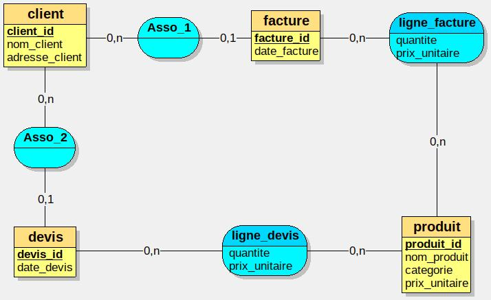

Modélisation – Renormalisation des données
Contexte du projet

Ce projet s’inscrit dans le cadre du module Modélisation des données de la formation B3 EPSI.

L’objectif de l’activité est de travailler à partir de fichiers CSV dénormalisés contenant des informations sur :

les clients

les factures

les devis

les produits

Ces fichiers contiennent plusieurs informations redondantes, notamment les données clients et produits répétées dans plusieurs lignes.

Le but du projet est de restructurer ces données afin de construire une base de données relationnelle normalisée.

Objectifs techniques

Le projet vise à :

analyser les fichiers de données fournis

identifier les redondances présentes dans les données

concevoir un modèle de données relationnel

créer une base de données structurée

automatiser l’intégration des données depuis les fichiers CSV

Jeux de données

Trois fichiers CSV sont utilisés dans ce projet.

factures.csv

Ce fichier contient :

les informations des clients

les informations des factures

les produits associés aux factures

Les informations clients et produits apparaissent plusieurs fois, ce qui entraîne une redondance des données.

devis.csv

Ce fichier contient :

les informations des clients

les informations des devis

les produits associés aux devis

Certaines informations sont également répétées dans plusieurs lignes.

produits.csv

Ce fichier contient les informations relatives aux produits :

identifiant du produit

nom du produit

catégorie

prix unitaire

Pipeline global du projet

Le projet suit les étapes suivantes :

Analyse des fichiers CSV fournis

Identification des données redondantes

Modélisation du schéma relationnel

Création de la base de données

Implémentation des tables SQL

Développement d’un script Python pour importer les données

Vérification de la cohérence des données

Modélisation des données

La base de données sera organisée autour des entités principales suivantes :

🔹 Clients

Informations sur les clients.

🔹 Produits

Informations sur les produits disponibles.

🔹 Factures

Factures associées aux clients.

🔹 Détails des factures

Produits associés à chaque facture.

🔹 Devis

Devis réalisés pour les clients.

🔹 Détails des devis

Produits associés aux devis.

Cette organisation permet :

de réduire la redondance

de maintenir l’intégrité des données

de clarifier les relations entre les entités

Stack technique
Base de données

SQL

PostgreSQL / MySQL

Traitement des données

Python

Pandas

Formats de données

CSV

Structure du projet
modelisation-renormalisation/

data/
    factures.csv
    devis.csv
    produits.csv

sql/
    schema.sql
    insert.sql

python/
    import_csv.py

README.md
Perspectives

Les prochaines étapes du projet consistent à :

concevoir le schéma relationnel

implémenter les tables SQL

automatiser l’import des données via Python

effectuer des requêtes SQL pour analyser les données

Équipe projet

Projet réalisé dans le cadre de la formation B3 EPSI – Modélisation des données

Membres de l’équipe :

Kouamé Johan Bilé

Joseph HACCANDY

Glody kUTUMBAKANA